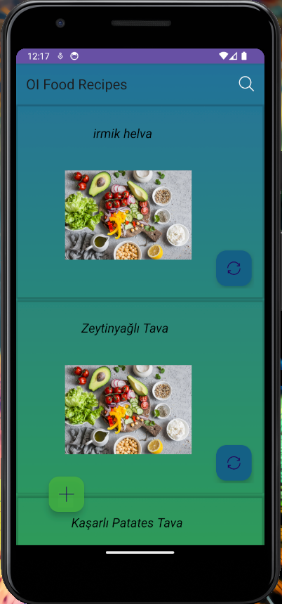
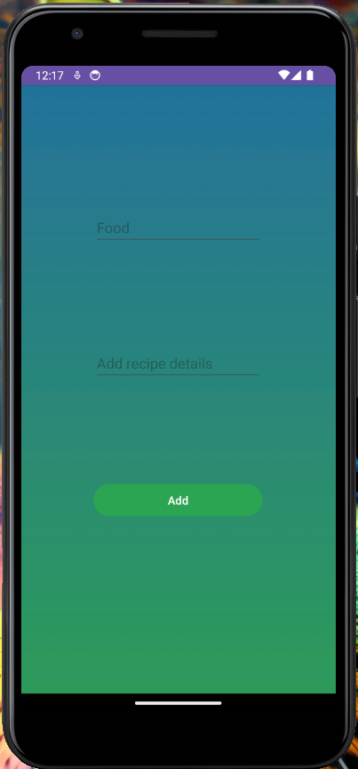
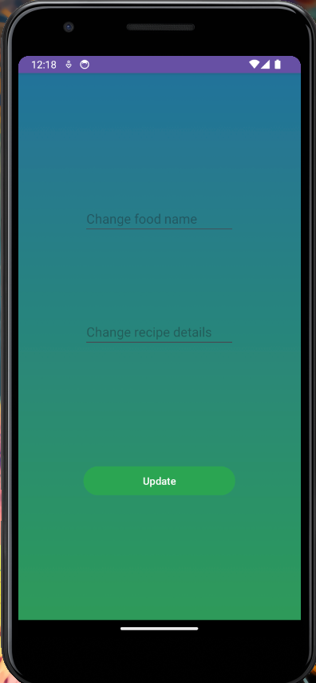

# Food Recipe App

This project is a recipe application developed using Kotlin. The app allows users to view and add various recipes.

## Screenshots

### Intro Screen
.png)

### Recipe List Screen

### Add Recipe Screen

### Update Recipe Screen

## Features

- View recipes
- Add new recipes
- Update existing recipes

## Installation

